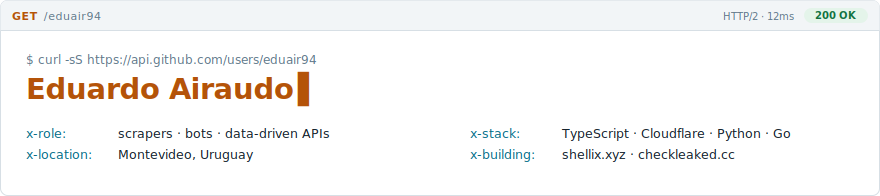
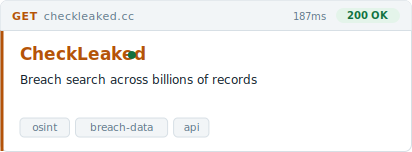
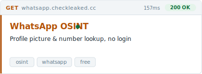
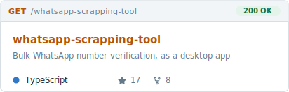
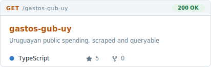
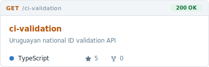
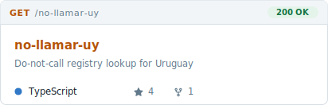
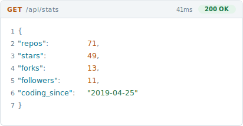
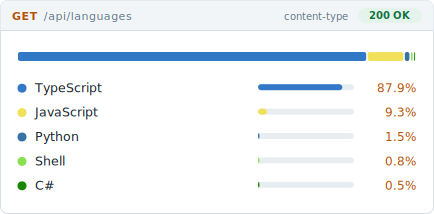

  <picture>
    <source media="(prefers-color-scheme: dark)" srcset="./assets/banner-dark.svg" />
    
  </picture>

  
  
  
  
  

---

### `GET /services`

**OSINT tools I run in production.** Free to use, no login for the basics, developer APIs behind them.

<!-- SERVICES:start -->

  <a href="https://checkleaked.cc">
    <picture>
      <source media="(prefers-color-scheme: dark)" srcset="./assets/service-1-dark.svg" />
      
    </picture>
  </a>
  <a href="https://whatsapp.checkleaked.cc">
    <picture>
      <source media="(prefers-color-scheme: dark)" srcset="./assets/service-2-dark.svg" />
      
    </picture>
  </a>

<!-- SERVICES:end -->

Status and latency above are real — measured against each service when these cards were last rendered.

---

### `GET /stack`

I build the unglamorous middle of the internet: the scraper that survives the anti-bot check, the queue that drains without supervision, the API that answers in 40ms.

- **Data extraction** — headless/browserless, rotating proxies, fingerprint variance, backoff that respects the target
- **Low-latency APIs** — edge functions, aggressive caching, streaming responses
- **Privacy & integrity** — breach correlation, hashing, rate mediation
- **Automation** — internal tooling, cron pipelines, observability glue

  

<strong>Principles</strong>

- Explicit beats clever.
- Maintainability and observability first; micro-optimization later.
- Defensive scraping — backoff, variance, and the legal/ethical line respected.
- Reach for a dependency only when the standard library genuinely runs out.

---

### `GET /projects`

<!-- PROJECTS:start -->

  <a href="https://github.com/eduair94/whatsapp-scrapping-tool">
    <picture>
      <source media="(prefers-color-scheme: dark)" srcset="./assets/repo-1-dark.svg" />
      
    </picture>
  </a>
  <a href="https://github.com/eduair94/ci-validation">
    <picture>
      <source media="(prefers-color-scheme: dark)" srcset="./assets/repo-2-dark.svg" />
      
    </picture>
  </a>
  <a href="https://github.com/eduair94/cambio-uruguay">
    <picture>
      <source media="(prefers-color-scheme: dark)" srcset="./assets/repo-3-dark.svg" />
      
    </picture>
  </a>
  <a href="https://github.com/eduair94/no-llamar-uy">
    <picture>
      <source media="(prefers-color-scheme: dark)" srcset="./assets/repo-4-dark.svg" />
      
    </picture>
  </a>

<!-- PROJECTS:end -->

Ranked by stars, regenerated daily. <a href="https://github.com/eduair94?tab=repositories&sort=stargazers">All 70+ repositories →</a>

---

### `GET /stats`

  <picture>
    <source media="(prefers-color-scheme: dark)" srcset="./assets/stats-dark.svg" />
    
  </picture>
  <picture>
    <source media="(prefers-color-scheme: dark)" srcset="./assets/langs-dark.svg" />
    
  </picture>

  <picture>
    <source media="(prefers-color-scheme: dark)" srcset="https://streak-stats.demolab.com/?user=eduair94&theme=github-dark-blue&hide_border=true&background=0F161D&border=22303C&ring=F0A02B&fire=F0A02B&currStreakLabel=C6D2DC&sideLabels=5C7080&dates=5C7080" />
    
  </picture>

  <picture>
    <source media="(prefers-color-scheme: dark)" srcset="https://raw.githubusercontent.com/eduair94/eduair94/output/github-contribution-grid-snake-dark.svg" />
    
  </picture>

---

### `POST /contact`

Open to consulting on scraping, automation and API work — or just a good bug report.

  
  
  

  
    Cards above are rendered from the GitHub API by
    <a href="./scripts/render-cards.mjs"><code>scripts/render-cards.mjs</code></a>
    and committed to this repo — no third-party card service to go down.
    Last updated: <!-- LAST_UPDATED -->2026-07-16<!-- /LAST_UPDATED -->
  

