<!-- ========================================================= -->
<!-- Title / Intro                                               -->
<!-- ========================================================= -->
<h1 align="center">Hey, I'm <strong>Eduardo</strong> — I build scrapers, bots & data-driven APIs</h1>

<em>Uruguay · Full‑stack & automation · Shellix / CheckLeaked</em>

  Focused on reliable data extraction, fast APIs & pragmatic automation. Accessibility & performance minded.

<!-- Social / meta badges (contrast friendly flat-square style) -->

  
  
  
  

<!-- Quick value proposition -->

<strong>I ship production scrapers, resilient automation pipelines and high‑signal APIs.</strong> 
Prefer <code>TypeScript + Cloudflare</code>, sprinkle <code>Python</code>/<code>Go</code> where they shine.

<!-- Nav (skip links) -->

  <a href="#featured-projects">Projects</a> •
  <a href="#my-stack">Stack</a> •
  <a href="#my-stats">Stats</a> •
  <a href="#commits">Commits</a> •
  <a href="#contact">Contact</a>

---

### What I do
- 🧪 Data extraction (anti‑bot evasion, headless/browserless, rotating proxies)
- ⚡ Low-latency API design (caching, edge functions, streaming)
- 🔐 Privacy & integrity checks (hashing, leak correlation, rate mediation)
- 🛠 Internal tooling & workflow automation
- 🚀 Dev experience improvements (CLIs, codegen, observability glue)

### My stack

  

<strong>Principles</strong>

- Favor explicitness over cleverness.
- Optimize for maintainability & observability first, micro‑opt later.
- Defensive scraping (backoff, fingerprint variance, legal + ethical boundaries respected).
- Minimal external dependencies when the standard library suffices.

---

### Featured projects
<!-- Repo pin cards -->

  <!-- Dark/light aware repo cards -->
  <picture>
    <source media="(prefers-color-scheme: dark)" srcset="https://github-readme-stats.vercel.app/api/pin/?username=eduair94&repo=no-llamar-uy&theme=github_dark&border_color=30363d" />
    <source media="(prefers-color-scheme: light)" srcset="https://github-readme-stats.vercel.app/api/pin/?username=eduair94&repo=no-llamar-uy&theme=default&border_color=dadada" />
    
  </picture>
  <picture>
    <source media="(prefers-color-scheme: dark)" srcset="https://github-readme-stats.vercel.app/api/pin/?username=eduair94&repo=cambio-uruguay&theme=github_dark&border_color=30363d" />
    <source media="(prefers-color-scheme: light)" srcset="https://github-readme-stats.vercel.app/api/pin/?username=eduair94&repo=cambio-uruguay&theme=default&border_color=dadada" />
    
  </picture>

  <picture>
    <source media="(prefers-color-scheme: dark)" srcset="https://github-readme-stats.vercel.app/api/pin/?username=eduair94&repo=gastos-gub-uy&theme=github_dark&border_color=30363d" />
    <source media="(prefers-color-scheme: light)" srcset="https://github-readme-stats.vercel.app/api/pin/?username=eduair94&repo=gastos-gub-uy&theme=default&border_color=dadada" />
    
  </picture>
  <picture>
    <source media="(prefers-color-scheme: dark)" srcset="https://github-readme-stats.vercel.app/api/pin/?username=eduair94&repo=recaptcha-solver-api&theme=github_dark&border_color=30363d" />
    <source media="(prefers-color-scheme: light)" srcset="https://github-readme-stats.vercel.app/api/pin/?username=eduair94&repo=recaptcha-solver-api&theme=default&border_color=dadada" />
    
  </picture>

<strong>More ideas / side projects</strong>

| Project | Focus |
|---------|-------|
| leak correlation tools | breach intelligence |
| lightweight proxy rotator | scraping infra |
| captcha workflow helpers | automation reliability |

---

### My stats

  <picture>
    <source media="(prefers-color-scheme: dark)" srcset="https://github-readme-stats.vercel.app/api?username=eduair94&show_icons=true&rank_icon=github&theme=github_dark&hide_border=false" />
    <source media="(prefers-color-scheme: light)" srcset="https://github-readme-stats.vercel.app/api?username=eduair94&show_icons=true&rank_icon=github&theme=default&hide_border=false" />
    
  </picture>
  <picture>
    <source media="(prefers-color-scheme: dark)" srcset="https://github-readme-stats.vercel.app/api/top-langs/?username=eduair94&layout=compact&theme=github_dark&hide_border=false" />
    <source media="(prefers-color-scheme: light)" srcset="https://github-readme-stats.vercel.app/api/top-langs/?username=eduair94&layout=compact&theme=default&hide_border=false" />
    
  </picture>

<!-- Streaks (contrast aware) -->

  <a href="https://git.io/streak-stats" aria-label="GitHub contribution streak">
    <picture>
      <source media="(prefers-color-scheme: dark)" srcset="https://streak-stats.demolab.com/?user=eduair94&theme=github-dark-blue&hide_border=false" />
      <source media="(prefers-color-scheme: light)" srcset="https://streak-stats.demolab.com/?user=eduair94&theme=default&hide_border=false" />
      
    </picture>
  </a>

<!-- Trophies (hide low-contrast background, theme tuned for dark/light) -->

  <a href="https://github.com/ryo-ma/github-profile-trophy" aria-label="GitHub profile trophies">
    <picture>
      <source media="(prefers-color-scheme: dark)" srcset="https://github-profile-trophy.vercel.app/?username=eduair94&margin-w=8&theme=onedark&no-frame=true" />
      <source media="(prefers-color-scheme: light)" srcset="https://github-profile-trophy.vercel.app/?username=eduair94&margin-w=8&theme=flat&no-frame=true" />
      
    </picture>
  </a>

<!-- Metrics (generated by GitHub Action below) -->

  

---

### Commits
<!-- Snake animation (dark/light) -->

  <picture>
    <source media="(prefers-color-scheme: dark)" srcset="https://raw.githubusercontent.com/eduair94/eduair94/output/github-contribution-grid-snake-dark.svg" />
    <source media="(prefers-color-scheme: light)" srcset="https://raw.githubusercontent.com/eduair94/eduair94/output/github-contribution-grid-snake.svg" />
    
  </picture>

### Star History
<a href="https://star-history.com/#eduair94/no-llamar-uy&eduair94/cambio-uruguay" aria-label="Star history chart for selected repositories">
  <picture>
    <source media="(prefers-color-scheme: dark)" srcset="https://api.star-history.com/svg?repos=eduair94/no-llamar-uy,eduair94/cambio-uruguay&type=Date&theme=dark" />
    <source media="(prefers-color-scheme: light)" srcset="https://api.star-history.com/svg?repos=eduair94/no-llamar-uy,eduair94/cambio-uruguay&type=Date" />
    
  </picture>
</a>

---

### Support / Hire
If my work saved you cycles or inspired something cool, you can:
- ⭐ Star a repo (free & helps discoverability)
- 🐛 Open issues with clear reproduction steps
- 🤝 Propose focused PRs
- 💼 Discuss a consulting / automation / scraping engagement (see contact below)

### Contact

  
  
  

Last updated: <!-- LAST_UPDATED -->2025-09-28<!-- /LAST_UPDATED --> · Automated sections (metrics, snake) refresh via GitHub Actions.

---

<strong>Accessibility notes</strong>

- Dark/light aware images use <code>&lt;picture&gt;</code> with alternate sources for improved contrast.
- Badges use higher-contrast foreground/background color pairs (WCAG AA+ target).
- Added descriptive <code>alt</code> text to all images for screen readers.

